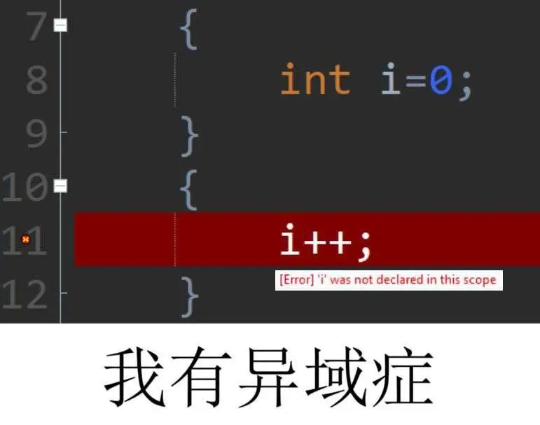

本部分讨论语法规则，介绍编程语言的形式符号背後共通的思想， **避免每次新学一门编程语言都在重复的语法知识点上浪费精力。** 接下来的内容使用多种主流编程语言讨论语法知识，以便观察这些形式语言背後的共性，不讨论具体的语法细节。

> 你可能需要先至少了解一门编程语言，才能更好地理解文章内容

> 以下内容没有很强的关联，大多内容不分先後，可按需阅读。

## 边角料

### 注释

注释（comment）是写在源代码里供人类阅读的内容，多用作解释代码原理、注意事项之类的。可以单独一行，也能跟在一般语句後面。

常见的符号有： `//` 、 `#` 、 `/**/`

```python {filename=Python}
print('hello from python!')     # 输出一句 hello from python!
```

还有多行的注释。

```c {filename=C}
/*
这是一个多行注释
用于说明代码的功能和目的。
你可以
在这里
面添加任何你想
要的说明信
息。
 */
```

### 语句终止符

许多语言使用分号 `;` 作为一句的结束标记。

```c {filename=C}
// 定义一个函数，计算两个数的和
int add(int a, int b) {
    return a + b;
}
```

也有语言使用换行、缩进整顿语句。

```python {filename=Python}
def multiplication_table(n):
    for i in range(1, n + 1):
        for j in range(1, n + 1):
            product = i * j
            print(f"{product}", end=' ')
        print()
```

### 转义符

转义符（escape character）用于在**字符串**里表示一些通常情况打不出来的特殊字符，如系统控制字符、语言的保留字等等。

最常见的是ASCII的“反斜杠加字符”。

```cpp {filename=C}
puts("Hello, World!\n"); // 换行符
puts("This is a tab:\tTabbed text."); // 制表符
puts("Here is a backslash: \\"); // 一个反斜杠
puts("\"C++ is awesome tho!\""); // 双引号
puts("Single quote: \'"); // 单引号
```

### 修饰符

## 表达式、语句

## 创建数据

### 标识符

数据需要占用一定的内存空间，每个空间需要有名字——标识符（identifier）才能被计算机正确识别。

标识符的命名自由，但并不完全任意，常见的约束有：

- 不得使用关键字（key word），这些是编程语言自己用作语法的字符；
- 不得带有特殊符号，空白符 ` ` 、百分符号 `%` 、哈希符号 `#` 等等；
- 不得以数字开头；
- 不得超出长度限制。

这些是合法的标识符：

```text
abc
minus45
getNum
fetch_bms_table
_area
```

这些是不合法的标识符：

```text
1second
#teshuzifu
her requiem
```

这些是……呃……是合法的标识符：

> 大多现代编程语言都可以用拉丁字母以外的字符起名，虽然不建议。

```text
übertragung
håndværker
说的道理
しょうひん

x̙͈̝̄͛̽̆͌́̕g̘̣̠̝̽͑͋̈̑̒͞q̛̤̦̝͋̔̋͌͒̆̋̚͡f̋̀͌̅͠
```

### 声明、定义、赋值

声明（declaration）并定义（definition）一个[变量](#变量字面量)。此时，空闲的内存空间被分配给这个变量，数据就存在这里受其管理。

定义名为“x”和“y”的变量，分别把10和20赋值（assignment）给x和y：

```c {filename=C}
int x;      // 声明
x = 10;     // 定义

// 可以写作一行
int y = 20;
```

动态语言不明确区分声明和定义。声明即是定义，定义即是声明。

```python {filename=Python}
# 声明并定义一个变量a，不赋值是会报错的
a = 'www'
```

### 变量、字面量

变量（variable）可以存储任何合法[数据类型](#数据类型)的数值。通常的声明、定义语句所创建的都是变量。

字面量（literal）则是各种数据的“具体形式”。字面量可以直接使用、作为变量的赋值：

```go {filename=go}
a := 42; // 42 是数字字面量
b := 'h'; // 'h' 是字符字面量
fmt.Println("greetings!"); // "greetings!" 是字符串字面量
```

## 运算符

- 算数：加减乘除、取模
- 比较：大于、小于、等于、不等于
- 逻辑：与或非
- 位运算：位与、位或、位非、位异或、位取反、移位
- 自增、自减
- 引用、解引用

有些运算使用同一种符号表示（如乘法和引用都使用 `*` ），这是很常见的情况。

> 有些语言的运算可能稍稍不符合数学直觉，但是无需强行记忆，不确定的话多加一层括号就得了。

（更多运算，参考各语言标准库）

## 数据类型

数字类的数据可以进行算数运算，但是对于文本类的数据，数字类型的运算规则没有意义。所以各种数据需要区分以不同的数据类型（Data type），对不同数据采用不同的处理规则。

有些语言在声明的时候，标识符旁边会有`int`、`float`之类的[修饰符](#修饰符)，这种类型修饰符指明该变量存储的是什么类型的数据。

不是所有语言都需要显式地指明类型，这取决于这门语言是**强类型**还是**弱类型**。

弱类型语言允许变量的类型在声明时不确定、允许后续改变类型；

```javascript {filename=javascript}
let dynamicVar; // 声明变量
let dynamicVar = 'hello';    // 字符串类型
dynamicVar = 233;    // 现在是数值类型
```

强类型语言的变量类型在声明时就被确定，且後续不能再变。

```cs {filename="C#"}
string staticVar = "233" // 定义字符串变量

staticVar = 233 // 爆！不能再赋值其他类型
/* Cannot implicitly convert type 'string' to 'int' */
```

### 基本数据类型

又称*原始数据类型*，存储单一、基本的数据。

基本数据类型并不是统一的，各语言定义了各自的基本数据类型。具体内容参考对应语言的文档。

例如Python的数字类型分为`int`、`bool`、`float`和`complex`；而Lua将所有的数字都视为浮点数。

### 复合数据类型

一种复合数据类型可以存储多个值，具有自己独特的处理规则。

使用语言内置的复合数据类型：

```python {filename=Python}
# 用字典储存三个传感器的数据
temperature_sensors = {
    # 用列表记录每个传感器探测到的数值
    "sensor1": [22.5, 23.0, 21.8],
    "sensor2": [20.5, 21.0, 19.8],
    "sensor3": [25.0, 24.5, 26.0]
}

# 使用dict类型自有的运算规则，添加一条数据
temperature_sensors["sensor4"] = [22.5, 23.0, 21.8]
```

或者，可以根据需求自定义复合数据类型：

```c {filename=C}
// 在C中，使用结构体定义一个叫做sensor的类型
struct sensor_t {
    const char* name;
    double data;
};

// 声明并赋值一个sensor类型的变量
sensor_t my_sensor = {
    name = "sensor_0",
    data = 25.9
};
```

> 官方的标准库以及第三方库提供许多实用的数据类型、数据结构。善用这些工具，避免被过多的底层细节所淹没。

### 指针、引用

指针（pointer）是特殊的一类复合数据类型（*许多不接近底层的语言不直接提供这种数据类型*）。指针存储的数据是**内存地址**，其占用大小通常只与机器位宽相关。譬如，64位的计算机，一个指针占用8字节；8位计算机的则占用1字节。

指针类型的变量也区分类型，是为了确保**解引用**（dereferencing）时能正确获取到对应地址所保存的数据，避免因类型不匹配导致的错误和未定义行为。

```c {filename=C}
int32_t a = 0;          // 一个32位整型变量
int32_t* ptr_a = &a;    // 该指针存储a的地址
int32_t deref_a = *ptr_a;  // 解引用ptr_a所存储的地址，获取到a的值并赋值给deref_a
```

引用（reference）可理解为给变量取了一个别名，对引用进行的所有操作等效于对该变量的操作。

引用存储的也是变量的地址，但不占用空间。引用一旦赋值就跟那个变量绑定，不可再更改，只有变量被销毁，引用才随之销毁。

```cpp {filename="C++"}
string b = "www";
string& ref_b = b;
ref_b = "mmm";      // b存储的值会相应改变
```

### 类型转换

不同的数据类型因不同的处理规则而无法进行运算，不过语言自身也考虑了不同数据类型之间运算的合理之处（比如字符串拼接、整数和浮点数相加），此时其中一些数据可能会被隐式类型转换（Implicit Type Conversion），从而正确运算。

```python {filename=Python}
s = "1 + 1 = "
n = 10
r = s + n # n 数字被隐式转换成了字符串，随後和 s 拼接
print(r)  # 输出: "1 + 1 = 10"
```

不过这种提前定义好的运算规则不可能覆盖所有情况，尤其是用户自定义的数据类型需要特定的数据类型。此时就可以通过显式类型转换（Explicit Type Conversion）把数据转换成预期的样子。

```js {filename=javascript}
const dateString = prompt();                    // 由用户输入的字符串
const pastTimestamp = Date.parse(dateString);   // 字符串转换为时间戳
const presentTimestamp = new Date().getTime()   // 当前时间的时间戳
const elapse = presentTimestamp - pastTimestamp // 两时间戳相减
```

## 流程控制

### 分支结构

分支结构会根据表达式的值，决定指定哪些语句块。

`if-else` 语句中，每次只会有一项语句块的代码被执行。

```c {filename=C}
if (a > 30) {
    puts("big a");
}
// 上面的表达式为假时，才会继续往下
else if (a < 15) {
    puts("small a");
}
else if (a == -1) {
    puts("bad a");
}
// 以上所有表达式都为假时，才会执行else的语句块
else {
    puts("middle a");
}
```

`switch` 语句需要一个*常量表达式*，这个常量表达式的值对应的 `case` **及以下**的语句块都会被执行。

```cpp {filename="C++"}
switch (x) {
    // 如果 x 为1，遇到break之前的所有语句块都会被执行
    case 1:
        std::cout << "x is 1" << std::endl;
    case 2:
        std::cout << "x is 2" << std::endl;
    case 3:
        std::cout << "x is 3" << std::endl;
        break;
    case 4:
        std::cout << "x is 4" << std::endl;
        break;
    // 以上case全都不满足，才会执行default的代码块
    default:
        std::cout << "x is x" << std::endl;
        break;
}
```

### 循环结构

`for` 三段式是循环语句最最常见的语法形式。一条for语句可接受三个表达式：

- **初始化循环变量**：定义若干存在于循环期间的变量，循环结束后销毁
- **结束条件**：表达式的值为真时，结束这个for语句
- **迭代动作**：当前循环结束后执行该表达式

```c
// 初始化一个变量 i；i大于等于10结束；每次迭代後i自增
for (int i=0; i<10; i++) {
    // 打印当前 i 的值
    puts(i);
}
```

> 三个表达式都可以为空，此时等价于while循环语句

`while` 循环只有一个结束条件的表达式。while会一直循环到表达式为假。

```c
//
int i = 100;
while (i) {
    i--;
}
```

还有一种，迭代器（Iterator）循环。迭代器是一些数据结构自带的东西，提供一种访问数据结构内部元素的方法，而无需暴露其内部结构。

> 迭代器更灵活、更符合直觉，不过这是比较现代语言的特性，远古一些的语言还是for循环依旧

```python {filename=Python}
# range(3) 的本质是生成了一个列表[0,1,2]
# 每次循环，循环变量 i 获取到迭代器的值
for i in range(3):
    print(i)

# 同理，两个循环变量每次获取迭代器的内容
a = {
    'n1':3,
    'n2':2,
    'n3':1
}
for i,j in a.items():
    print(i,j)
```

## 代码结构

### 函数

函数（Function）可以把一些代码打包起来，在对应需要的地方使用，以减少重复代码和工作量。

一般的函数可分为：

- 函数名：这个函数的标识符
- 函数体：该函数所执行的内容
- 参数：执行该函数所需要的数据，可以为空
  - 形式参数：参数的标识符，只会在函数体内用到
  - 实际参数：传入的具体数据
- 返回值： 函数执行完毕後返回的值，可以为空

```python
# 不使用函数，计算勾股定理
a1 = 3 ** 2
b1 = 4 ** 2
c1 = a1 * b2

a2 = 6 ** 2
b2 = 8 ** 2
c2 = a2 * b2

c3 = 13 ** 2 + 14 ** 2 # 即使简化成一行也要写很多

# 定义函数，这个函数需要两个参数进行计算
def gougu(a, b):
    c = a ** 2 + b ** 2
    return c
# 使用函数，只需传入实际参数即可
c1 = gougu(3,4)
c2 = gougu(6,8)
c3 = gougu(13,14)
```

### 类

类（Class）是一种将“数据”和“处理数据的方法”**聚合在一起**的结构，以“生物遗传学”的思维方式来管理代码。

> 类和结构体一样，都创造新的[复合数据类型](#数据类型)

```python {filename="python"}
# 创建一个传感器的类
# 这个类有一个数据 pos
# 还有两个处理数据的方法 getPos 和 setPos
class Sensor:
    pos = float()
    def getPos(self):
        print("data:", self.pos)
    def setPos(self, value):
        self.pos = value

# 创建一个Sensor类型的变量
my_sensor = Sensor()
# 使用setPos操纵数据
my_sensor.setPos(2.17800)
```

<!-- > 这是一种面向对象编程（OOP, Object Oriented Programming）的特点——数据和处理方法**聚合在一起**。与之相对的数据和处理方法分离，就是面向过程编程（POP, Procedure Oriented Programming）。 -->

### 作用域、生命周期

作用域（Scope）指的是变量、函数等对象被定义和**能够被访问**的代码区域。整个程序都能访问到的，就是全局变量（Global Variables）。

生命周期（Lifecycle）指的是变量、函数等对象在内存中存在的时间，通常由语言的编译器或运行时环境管理，无需人类操心。生命周期通常和作用域相关。

> C风格语法的语言中，常见用花括号 `{}` 控制变量的作用域和生命周期。花括号内，可访问所有当前作用域、所有上层作用域的对象。



上图中，变量i的生命周期从第一个花括号开始，作用域仅有当前花括号内；第一个花括号之後，i的生命周期结束并且**被销毁**。
